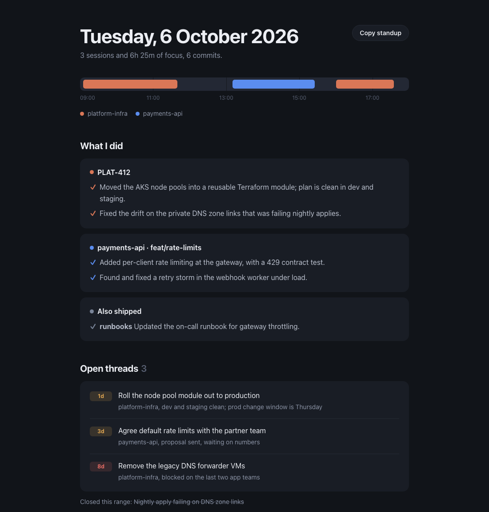

# ccworklog

**Remember what you actually did.** A daily and weekly worklog, built from your Claude Code sessions and git history.

Working with AI has changed the shape of an engineer's day. You move between more threads, ship more small things, and hand more of the doing to an agent. The work moves fast, and it's hard to keep hold of. By Thursday, Monday is a blur. By the weekly sync, last week is a guess. Standups turn into scrolling back through terminals and git logs trying to rebuild what happened.

On top of that, Claude Code deletes session transcripts after 30 days by default, so the record of how you solved something disappears with them.

ccworklog reads the sessions already on your machine and turns them into a worklog: what you did, grouped by piece of work, what's still open, and a standup you can paste. It runs locally, on your existing Claude Code plan, and keeps a summary of every session after the transcripts are gone.



## What you get

- **A worklog pane in Claude Code.** `/worklog` opens a pane beside the transcript with four tabs:
  - **Standup:** what you did, one card per workstream.
  - **Log:** the detail behind each item, including the errors you hit and the files you touched.
  - **Threads:** open loose ends, with how long each has been open.
  - **Timeline:** when you worked, coloured by project.
- **A report in your browser.** One page with the day on a timeline, what you did, open threads and the full detail. It works offline and in light or dark mode.
- **A standup you can paste.** One key copies it, grouped by workstream, ready for Slack or Teams.
- **Threads that carry forward.** Unfinished work found today is still on the list tomorrow, until a later session or commit closes it.
- **Git folded in.** Commits are matched to the work they belong to, including commits made outside Claude Code.

## Install

In Claude Code:

```
/plugin marketplace add okaneconnor/ccworklog
/plugin install ccworklog@ccworklog
```

Then run `/worklog`. It works on the session history already on your machine, so your first report can cover the last few weeks.

**Requirements:** Claude Code 2.1.287 or later for the pane, Node 18 or later, and git 2.37 or later, on macOS, Linux or WSL.

## Use it

| Command | What it covers |
| --- | --- |
| `/worklog` | Today |
| `/worklog yesterday` | Yesterday |
| `/worklog week` | This week so far |
| `/worklog lastweek` | Last week, Monday to Sunday |
| `/worklog 2026-10-06` | One day |
| `/worklog 2026-10-01..2026-10-07` | A range of days |
| `/worklog today --fresh` | Rewrites the report even if nothing changed |
| `/worklog purge 2026-10-06` | Deletes what ccworklog stored for that range |

In the pane:

| Key | Action |
| --- | --- |
| `1` to `4` | Switch tabs |
| `c` | Copy the standup |
| `o` | Open the report in your browser |
| `r` | Regenerate the report |
| `n` and `p` | Next and previous workstream in the Log tab |

A typical week looks like this:

1. **End of the day:** run `/worklog` and check it reads right.
2. **Before standup:** open the pane and press `c`.
3. **Monday morning:** run `/worklog lastweek` for the week's summary and the threads you left open.

## How it works

1. **Collect.** Scripts read your transcripts under `~/.claude/projects` and the git history of the repos you worked in. Secrets such as tokens and keys are redacted before anything is stored.
2. **Summarise.** Each session is summarised on Haiku, four at a time. Summaries are cached, so a session is only summarised again when it changes.
3. **Group.** Sessions are grouped into workstreams by ticket number in the branch name, or by repo and branch.
4. **Write.** Sonnet merges the workstreams into one report: a narrative per workstream, the standup, and the open threads.
5. **Render.** The report becomes the pane, an HTML page and a plain-text standup.

Everything is stored in `~/.local/share/ccworklog`, outside `~/.claude`, so it survives Claude Code's cleanup.

ccworklog is a [Claude Code mod](https://code.claude.com/docs/en/plugins/mods/overview): the pipeline runs as code inside Claude Code, without going through your conversation. Where mods are off, such as with `disableAllHooks` set, or in an organisation that only allows managed mods, `/worklog` falls back to a skill that runs the same pipeline through Claude.

## Privacy and cost

- **Local.** Transcripts, summaries and reports stay on your machine. The scripts make no network calls, and there is no API key to set up.
- **On your plan.** Summaries and the report use your existing Claude Code usage: one short Haiku call per changed session and one Sonnet call per report. A large first backfill asks before it starts.
- **Review before sharing.** Reports come from your own sessions, so they can include anything you worked on. Use `exclude_repos` to leave a repo out entirely.

## Configuration

Optional, in `~/.local/share/ccworklog/config.json`:

```json
{
  "open": "always | never | weekly-only",
  "exclude_repos": ["/path/to/client-repo"],
  "extra_repo_roots": ["/path/to/repo-you-commit-to-outside-claude-code"]
}
```

- `open` sets when the skill fallback opens the report in your browser. In the pane, press `o`.
- `exclude_repos` leaves those repos out of every report.
- `extra_repo_roots` adds repos to read git history from when you commit to them outside Claude Code.

## Development

```
npm test                    # scripts: collect, redact, render
claude plugin test .        # the mod: pipeline, views and pane
claude plugin validate .    # manifest and hooks
claude --plugin-dir .       # run this checkout in a session
```

## License

MIT
